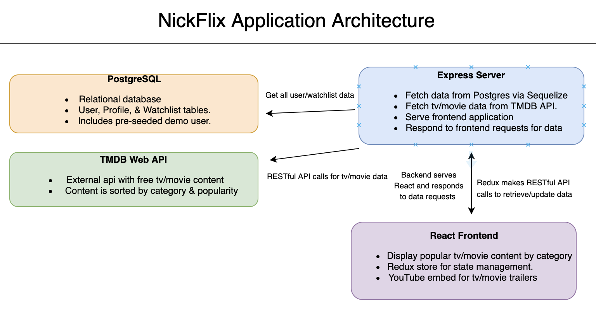

# NickFlix Wiki

Welcome to the NickFlix wiki!

This is a full-stack web application built using React + Redux (front-end) & Sequelize + Express + PostgreSQL (back-end)

This project is currently hosted on Heroku!  [NickFlixApp](https://nickflixapp.herokuapp.com/)

## MVP Feature List:

### Feature 1: User Authentication
* Users can create an account in order to access the main content of the site.
* Users can login/logout and persist their sessions across different pages and page reloads.
* Users can update their personal details on the account page.
* There is a demo user available in order to provide easy access to exploring full site functionality.

### Feature 2: Home Page
* Logged in users can view a collection of movies/shows sorted by categories (i.e. Trending, Most Popular).
* Content is generated dynamically by fetching data from a third-party api.
* Users can click on a title to view a trailer.

### Feature 3: Profiles & Watchlists
* Each user can create multiple profiles.
* Each profile can set a custom name and select an image from a list of profile images.
* Each profile can add or remove videos from their watchlist to view them at a later date.
* Profiles and Watchlists persist across logins.

## Stretch Goals:

### Bonus Feature (Time-permitting): Search
* Users can search for a specific category or title and be given a list of related content.

</br>

## Application Architecture:


<br></br>

## Database Schema:


<br></br>

## Backend Routes:


| Method         | Path                     | Purpose                    |
|---             |---                       |---                         |
| POST           | /api/users               |  Create User               |
| POST           | /api/session             |  Login User                |
| GET            | /api/session             |  Get Current User          |
| DELETE         | /api/session             |  Logout User               |
| GET            | /api/content/:contentId  |  Fetch Movie Content       |
| GET            | /api/csrf/token          |  Generate CSRF Token       |
| POST           | /api/profiles            |  Create a new Profile      |
| GET            | /api/profiles/:userId    |  Get all profiles for user |
| DELETE         | /api/profiles/:profileId |  Delete Profile            |
| GET            | /api/tvtrailer/:id       |  Fetch a TV Trailer        |
| GET            | /api/watchlists/:wlid    |  Get Watchlist Content     |
| POST           | /api/watchlists/:wlid    |  Add To Watchlist          |
| DELETE         | /api/watchlists/:wlid    |  Remove From Watchlist     |


<br></br>

## Redux Sample State:

Redux is used throughout the project to manage application state.

Current sample state:

`{
```
    authentication: { id: 1, email: demo@user.io},
```
```
    profiles: {current: {
                id: 45,
                name: Nick,
                imageLink: 4,
                userId: 1,
                watchListId: 47,
                createdAt: "2020-09-07T20:48:00.368Z",
                updatedAt: "2020-09-07T20:48:00.368Z"},
             all: [{
                id: 45,
                name: Nick,
                imageLink: 4,
                userId: 1,
                watchListId: 47,
                createdAt: "2020-09-07T20:48:00.368Z",
                updatedAt: "2020-09-07T20:48:00.368Z"
               },
               {
                id: 49,
                name: Johnathon,
                imageLink: 3,
                userId: 1,
                watchListId: 51,
                createdAt: "2020-09-10T02:13:46.434Z",
                updatedAt: "2020-09-10T02:13:46.434Z"
              }]},
```
```
watchlist: [{
      id: 98,
      watchListId: 47,
      poster_path: '/qcr9bBY6MVeLzriKCmJOv1562uY.jpg',
      createdAt: '2020-09-07T20:55:17.082Z',
      updatedAt: '2020-09-07T20:55:17.082Z'
    },
    {
      id: 114,
      watchListId: 47,
      poster_path: '/1QpO9wo7JWecZ4NiBuu625FiY1j.jpg',
      createdAt: '2020-11-02T19:12:51.682Z',
      updatedAt: '2020-11-02T19:12:51.682Z'
    },
    {
      id: 140,
      watchListId: 47,
      poster_path: '/eWivEg4ugIMAd7d4uWI37b17Cgj.jpg',
      createdAt: '2020-11-03T22:19:50.731Z',
      updatedAt: '2020-11-03T22:19:50.731Z'
    }],
```
```
trailer: {path: "sfM7_JLk-84", category: "pn"}
```
}`

## Movie & TV Data Attribution:
### All movie/tv data is provided and owned by The Movie Database API.
### [ -- Check Them Out Here --](https://www.themoviedb.org/)

***


