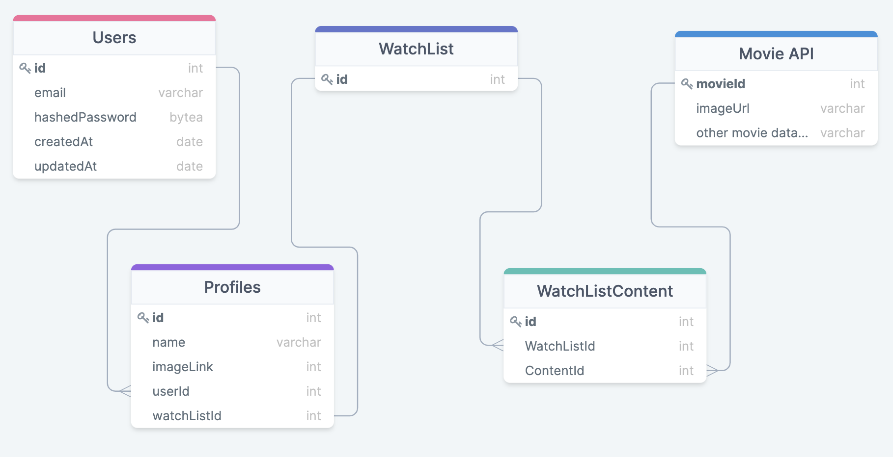

# NickFlix Wiki

Welcome to the NickFlix wiki!

This is a full-stack web application built using React + Redux (front-end) & Sequelize + Express + PostgreSQL (back-end)

This project is currently hosted on Heroku!  [NickFlixApp](https://nickflixapp.herokuapp.com/)

## MVP Feature List:

### Feature 1: User Authentication (_Estimated time:_ 2 days - 8/31 - 9/01)
* Users can create an account in order to access the main content of the site.
* Users can login/logout and persist their sessions across different pages and page reloads.
* Users can update their personal details on the account page.
* There is a demo user available in order to provide easy access to exploring full site functionality.

### Feature 2: Home Page (_Estimated time:_ 2 days - 9/02 - 9/03)
* Logged in users can view a collection of movies/shows sorted by categories (i.e. Trending, Most Popular).
* Content is generated dynamically by fetching data from a third-party api.
* Users can click on a title to view more information about it.

### Feature 3: Profiles & Watchlists (_Estimated time:_ 1 days - 9/04 - 9/04)
* Each user can create multiple profiles.
* Each profile can set a custom name and select an image from a list of profile images.
* Each profile can add or remove videos from their watchlist to view them at a later date.
* Profiles and Watchlists persist across logins.

## Stretch Goals:

### Bonus Feature (Time-permitting): Search
* Users can search for a specific category or title and be given a list of related content.


## Database Schema:



## RESTful EndPoints In Express:

| Method         | Path                     | Purpose              |
|---             |---                       |---                   |
| Get            | /                        |  Home Page           |
| Get            | /users/create            |  Sign-Up Form        |
| Get            | /users/login             |  User Login Form     |
| Post           | /users                   |  Create User Account |
| Post           | /users/login             |  Authenticate User   |
| Get            | /users/:id               |  Access User Account |
| Get            | /users/:id/update        |  Form to Update Account Details |
| Put            | /users/:id/update        |  Update Account Details |
| Delete         | /users/:id               |  Delete User Account |
| Get            | /users/:id/profiles      |  View a list of profiles |
| Post           | /users/:id/profiles/:pId |  Create a new profile|
| Delete         | /users/:id/profiles/:pId |  Delete a profile |
| Post           | /profiles/:pId/watchlist |  Create a watchlist|

## Redux Sample State:

Redux is used throughout the project to manage application state.

Current sample state:

`{
```
    authentication: { id: 1, email: demo@user.io},
```
```
    profiles: {current: {
                id: 45,
                name: Nick,
                imageLink: 4,
                userId: 1,
                watchListId: 47,
                createdAt: "2020-09-07T20:48:00.368Z",
                updatedAt: "2020-09-07T20:48:00.368Z"},
             all: [{
                id: 45,
                name: Nick,
                imageLink: 4,
                userId: 1,
                watchListId: 47,
                createdAt: "2020-09-07T20:48:00.368Z",
                updatedAt: "2020-09-07T20:48:00.368Z"
               },
               {
                id: 49,
                name: Johnathon,
                imageLink: 3,
                userId: 1,
                watchListId: 51,
                createdAt: "2020-09-10T02:13:46.434Z",
                updatedAt: "2020-09-10T02:13:46.434Z"
              }]},
```
```
watchlist: {id: 47}
```
}`

## Movie & TV Data Attribution:
### All movie/tv data is provided and owned by The Movie Database API.
### [ -- Check Them Out Here --](https://www.themoviedb.org/)

***


